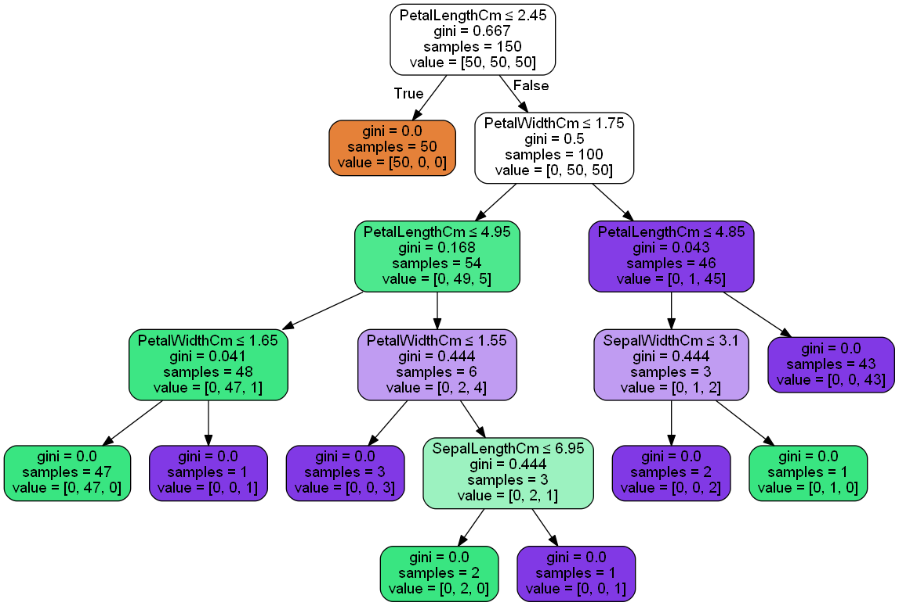

# Decision-Tree-ML
# Prediction Using unsupervised ML
This project uses the Iris data set from TSF GRIP Tasks

# DATASET DESCRIPTION

*This dataset has 150 samples with 6 features, It includes three iris species with 50 samples each as well as some properties about each flower. One flower species is linearly separable from the other two, but the other two are not linearly separable from each other.

The columns in this dataset are:

**Id**\
**SepalLengthCm**\
**SepalWidthCm**\
**PetalLengthCm**\
**PetalWidthCm**\
**Species**

# This project intends to create decision tree classifier and visualize it graphically

## Result Obtained

.

### Conclusion:
Any new test data can be added to this classifier and it would be able to predict the right class accordingly.
